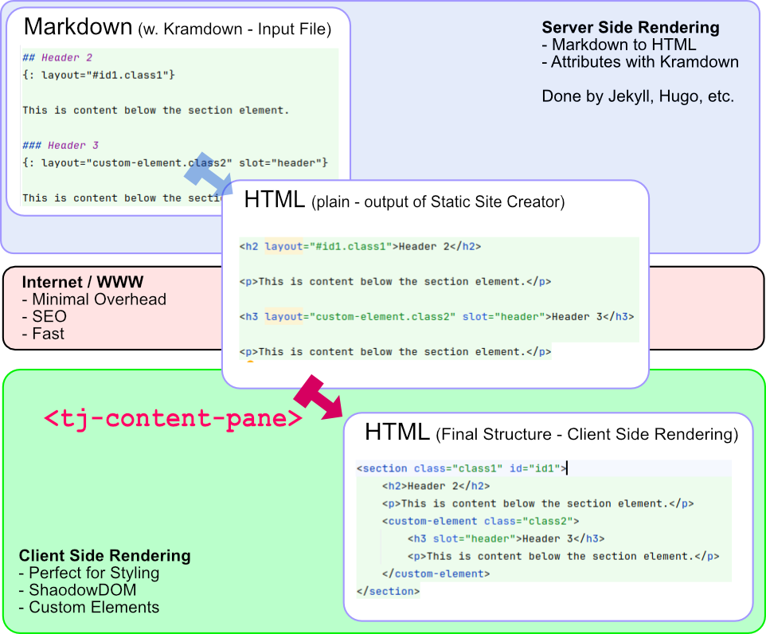

# tj-content-pane

Transforms plain html to a tree structure of sections, articles, and other elements. js-content-pane is a pure
Client-Side Rendering (CSR) solution. It is designed to style the unstyled output of static site generators (SSG) like
Jekyll, Hugo, or others. These provide SEO-friendly HTML output, but the structure is often not ideal for styling.



Most Static Site Generators (SSG) support Kramdown, where you can assign attributes to elements in the markdown source by
using the `{: layout="selector" slot="slotname"}` syntax.

## Basic Usage

Wrap the area that should be transformed with the Custom Element:

```html
<tj-content-pane>
    <h1>Header 1</h1>
    <p>This is content below the header element.</p>
</tj-content-pane>
```

Normally this will happen in the template of a static site generator, like this:

```html
<tj-content-pane> {{content}} </tj-content-pane>
```

## Layouts

The Attribute `layout` can be used to specify a layout for the element. Use the css selector syntax to specify
tag, id or classes.

```markdown
## Header 2
{: layout="#id1.class1[slot=slotname]"}

This is content below the section element.
```

Will be transformed to:

```html
<section class="class1" id="id1">
    <h2>Header 2</h2>
    <p>This is content below the section element.</p>
</section>
```

## Layers (I)

Layers are defined using `layout="2.;"` syntax.

- Create new layer with: `layout="2.;"`
- Append to element of layer: `layout="+2.;"`
- Skip this element: `layout="-;"`

Example:

```markdown
## Header 2
{: layout="2;#id1.class1"}

---
{: layout="2.5;.class2"}

```

### Subelements

The strcutrure of the content is defined by the h2-h6 elements.

```markdown
## Header 2

text

### Header 3

text

### Header 3

text
```

will transform to: (By default, the h2 elements are transformed to section elements, and h3-h6 elements to divs)

```html
<section>
    <h2>Header 2</h2>
    <p>text</p>
    <div>
        <h3>Header 3</h3>
        <p>text</p>
    </div>
    <div>
        <h3>Header 3</h3>
        <p>text</p>
    </div>
</section>
```
