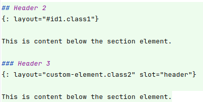
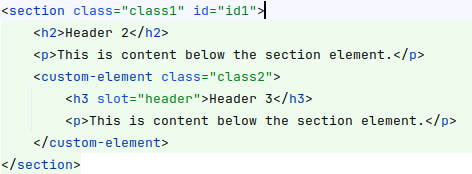

# tj-content-pane

Transforms plain html to a tree structure of sections, articles, and other elements.

 

## Basic Usage

Wrap the area that should be transformed with the Custom Element:

```html
<tj-content-pane>
    <h1>Header 1</h1>
    <p>This is content below the header element.</p>
</tj-content-pane>
```

Normally this will happen in the template of a static site generator, like this:

```html
<tj-content-pane> {{content}} </tj-content-pane>
```

## Layouts

The Attribute `layout` can be used to specify a layout for the element. Use the css selector syntax to specify
tag, id or classes.

```markdown
## Header 2
{: layout="#id1.class1"}

This is content below the section element.
```

Will be transformed to:

```html
<section class="class1" id="id1">
    <h2>Header 2</h2>
    <p>This is content below the section element.</p>
</section>
```

### Subelements

The strcutrure of the content is defined by the h2-h6 elements.

```markdown
## Header 2

text

### Header 3

text

### Header 3

text
```

will transform to: (By default, the h2 elements are transformed to section elements, and h3-h6 elements to divs)

```html
<section>
    <h2>Header 2</h2>
    <p>text</p>
    <div>
        <h3>Header 3</h3>
        <p>text</p>
    </div>
    <div>
        <h3>Header 3</h3>
        <p>text</p>
    </div>
</section>
```
