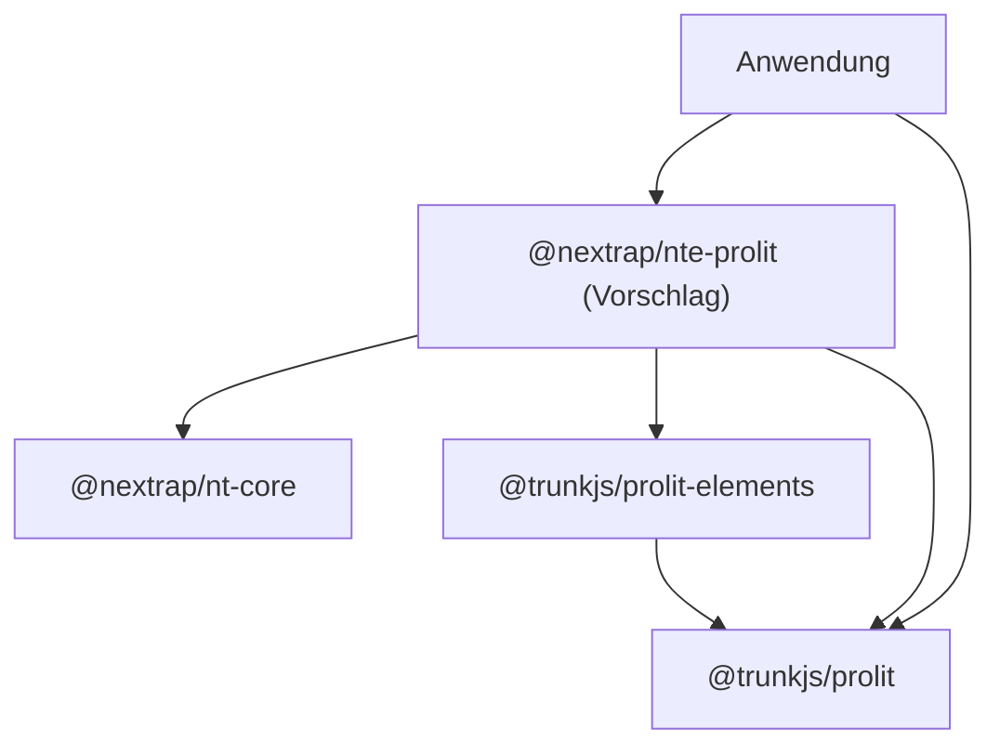

# Prolit Elements Frontentwurf

| Datum | Benutzername | Kurzbeschreibung |
|---|---|---|
| 2026-09-12 | dermatthes | §§ 1–9: Konzept, Bestandsanalyse und alternative API-Beispiele angelegt |
| 2026-09-12 | dermatthes | § 1, §§ 3–6, §§ 8–10: Scope-Verträge vereinheitlicht, Fehler und Abbruch präzisiert, SPA-Kernbeispiele aus Bibliotheks- und Anwendungssicht ergänzt |
| 2026-09-13 | dermatthes | §§ 1, 3–6, 8–10: universelle Scope-Directive, unabhängige DOM-Scopes, ProlitAware und Fallback; nummerierte Beispiele nach aktuellen Coding-Regeln |
| 2026-09-13 | dermatthes | §§ 1, 3, 8–10: direkte Lit-Einbindung als Standard; optionales Light-DOM-Mixin und Nextrap-Komfortbasis mit gerichtetem Paketvertrag |

## § 1 Ziel und Lesereihenfolge

Eine Komponente zeigt in einer Datei ihre Daten, Aktionen, Startbedingungen und ihr HTML. **Eine Ziel-API für Tabelle, Suche und Dialog:** lokale Werte stehen direkt im Scope, lesbare Remote-Daten in `scopeResource`, asynchrone Aktionen unter `$fn` in `scopeAction`. Beide Async-Bausteine verwenden `pending`, `error` und denselben Ergebnisvertrag. Die Beispiele stellen keine konkurrierenden API-Varianten mehr zur Wahl.

Dies bleibt ein **API-Entwurf**, keine Implementierung und keine lauffähige Demo. Dateien außerhalb von `src/`, neue Exporte und neue Semantik sind ausdrücklich markiert. Service-Implementierungen fehlen absichtlich. Das zusätzliche Komfortverhalten muss im Kern implementiert werden; die aktuelle Bibliothek kann diese Beispiele noch nicht unverändert ausführen.

Die [nummerierte Beispielreihe](examples/README.md) führt vom vollständigen Lade-/Auswahlablauf über die DOM-Platzierung zum Nextrap-Dialog und seiner aufrufenden Tabelle. Anschließend folgen austauschbare Inhalte, Suche, Parent-/Route-Eingaben, Live-Daten und Fallback-/Fehlerfälle. Jeder Schritt nennt seine Voraussetzungen und sein sichtbares Ergebnis. Imports und Entwurfsstatus werden einmal am Einstieg erklärt; die TS-Dateien bleiben Anwendungsausschnitte. Schritt 10 zeigt zusätzlich die Nextrap-eigene Integrationsbasis und ihre Paketgrenze. [geändert]

Die zentrale Vereinheitlichung lautet **`prolit(scope, fallback?)` am konkreten Lit-Einfügepunkt**. `scopeDefine` definiert Daten und Verhalten ohne Hostbindung. Eine eigene `ProlitElement`-Basisklasse gehört nicht mehr zur Ziel-API. Direkte Einbindung ist der Standard; ein optionales Light-DOM-Mixin und Nextrap-eigene Komfortbasen dürfen darauf aufbauen. Bewertung und Grenzen stehen im [Framework-Vergleich](framework-vergleich.md). [geändert]

## § 2 Aktueller Stand und belastbare Befunde

Geprüfter Quellstand: TrunkJS `ad4ba6a392ae470fa4b6d5abcc483e70733fbe32`, Nextrap `85cfd2edb07b6d885ca78b685e89c954775d3545`. Die Paketnummer allein ist kein Reifegradnachweis. Die folgende Bewertung beruht auf Quellcode und vorhandenen Tests, nicht auf einem vollständigen Laufzeitaudit.

### § 2.1 Vorhandener Ablauf

`prolit_html` erzeugt ein `ProLitTemplate`. Beim ersten Rendern wird der HTML-String in einen AST und daraus in eine JavaScript-Funktion übersetzt; diese verwendet `with($scope)` und Lit-Funktionen. Weitere Aufrufe derselben Template-Instanz verwenden die kompilierte Funktion erneut. Es wird kein Lit-Quellmodul erzeugt: Die Funktion liefert zur Laufzeit ein Lit-TemplateResult, das Lit in DOM umsetzt.

| Baustein | Schon vorhanden | Grenze |
|---|---|---|
| `Html2AstParser` / `Element2Function` | `{{ }}`, `*for`, `*if`, `*do`, `*catch`, `*log`, `.property`, `?boolean`, `@event`, `~class`, `~style` | Eigene Syntax und Codegenerierung benötigen eigene Diagnostik und Tests |
| `scopeDefine<T>` | generischer Rückgabewert, `$fn`, `$this`, `$update`, `$raw`, `$rawPure`, Template-Bindung | offener `any`-Index; Proxy beobachtet nur direkte Zuweisungen |
| `ProLitTemplate` | `render()`, zwei DOM-Renderhelfer, Cache pro Instanz | Rückgabetyp des generierten Renderers fälschlich `string`; zwei nahezu identische DOM-Methoden |
| `ProlitScope` | `<prolit-scope>`, externe/inline Templates, `init`, Light DOM, Übernahme benannter Inputs | konkrete `ReactiveElement`-Komponente, keine entworfene Dual-DOM-Basisklasse |
| Fehlerbehandlung | Syntaxprüfung und Fehlerkontext; `*catch` kann Fehler abfangen | Fehler werden gemeldet/abgefangen, nicht automatisch korrigiert; Quellpositionen unzuverlässig |

Quellen: [Scope](../../prolit/src/lib/scopeDefine.ts), [Template](../../prolit/src/lib/ProLitTemplate.ts), [Compiler](../../prolit/src/parser/Element2Function.ts), [Lit-Umgebung](../../prolit/src/lib/lit-env.ts), [ProlitScope](../src/components/prolit-scope/prolit-scope.ts).

### § 2.2 Konkrete Lücken vor einer stabilen API

- `$hooks` und `$on` sind in `ScopeDefinition` beschrieben, werden in den geprüften Kern-/Elementdateien aber nicht ausgeführt. `$ref`-Code wird generiert, obwohl die Lit-Umgebung `ref` nicht bereitstellt.
- `@event` erzeugt einen parameterlosen Handler: Ein lokales `$event` fehlt. Das synchrone `catchError` erfasst außerdem keine späteren Promise-Rejections asynchroner Callbacks.
- Der Proxy setzt Daten auf dem Originalobjekt; die Template-Bindung kann ebenfalls auf diesem Originalobjekt liegen. Template-Ausdrücke umgehen damit unter Umständen die Proxy-Update-Benachrichtigung. `$update()` bleibt für tiefe Mutationen wie `items.push(...)` ohnehin nötig. Das ist noch kein konsistenter reaktiver Vertrag.
- Die Demo `test-component1.ts` erstellt den Scope auf Modulebene. Mehrere Instanzen teilen Daten und überschreiben `$this`; der neue Ansatz muss zwingend pro Instanz einen Scope erzeugen.
- `ProlitScope.updated()` erstellt bei jedem Aufruf eine neue Listener-Funktion. `removeEventListener` mit dieser neuen Referenz entfernt die zuvor registrierte Funktion nicht. Eine stabile Listener-Referenz und Disconnect-Bereinigung fehlen.
- `src`-Änderungen lösen in `updated()` keinen eigenen Reload aus. Initialisierung kann sowohl über Connect als auch über die erste Property-Aktualisierung starten; Template-Neukompilierung und konkurrierende Initialisierung sind nicht konsistent geregelt.
- Die Input-Übernahme verwendet pauschal `.value` und flache Namen. Checkboxen, Mehrfachauswahl, verschachtelte Daten und eigene Komponenten brauchen explizite Regeln; automatische breite DOM-Suche darf nicht fremde Kindkomponenten auslesen.
- `ProLitTemplate.getCompiledTemplate()` parst vor `prolit_compile()` und damit zweimal. `prolit_html` verkettet `${...}` direkt zu Template-Quelltext. Das ist keine sichere Lit-Werteinterpolation.
- Typdeklarationen und README verwenden teilweise noch `tj-html-scope`, obwohl `prolit-scope` registriert wird. Generics prüfen JavaScript in HTML-Strings nicht automatisch.

Diese Punkte werden in diesem PR dokumentiert, nicht nebenbei repariert. Die vorhandenen Directive-Tests zeigen viele Einzelbausteine; beispielsweise rendert der Event-Test nach dem Klick explizit erneut und belegt somit keine automatische Aktualisierung einer realen Komponente.

## § 3 Komponenten- und DOM-Vertrag

### § 3.1 Eine Directive als universelle Verbindung

`scopeDefine({ ... })` erzeugt einen eigenständigen Scope. Erst die vorgeschlagene Lit-Directive `prolit(scope, fallback?)` bindet ihn an einen Child-Part und damit an einen eindeutigen Renderort. `$this` ist für diese Ziel-API nicht erforderlich. Die Directive kompiliert/rendert das Scope-Template, abonniert dessen Änderungen und verwaltet die Verbindung. Das Erzeugen eines TemplateResult allein montiert nichts; der umgebende Lit-Renderer muss es committen.

| Sichtbarer Anschluss | Renderort / Besitzer |
|---|---|
| `render(prolit(scope), target)` | Inhalt von `target`; Aufrufer verwaltet den Lit-Root |
| `` html`<nte-dialog>${prolit(scope)}</nte-dialog>` `` im Host-Template | Light DOM von `nte-dialog`; bestehender Host verwaltet seinen Root |
| `` renderDialog() { return html`${prolit(this.contentScope)}`; } `` | Inhaltspunkt der vorhandenen Nextrap-Hülle |
| `render()` mit `prolit(this.shadowScope)` | bestehender Lit-Host rendert seinen Shadow Root |
| `withProlitLightDom(LitElement)` mit `lightScope` | optionales Mixin verwaltet zusätzlich einen separaten Light-DOM-Bereich |
| `createRenderRoot() { return this; }` mit `render()` | reines Light-DOM-Element: ein normaler Lit-Root, ohne Mixin |

Der Ort bestimmt sich durch den Einfügepunkt, nicht durch den Scope oder den Klassennamen. Eine Komponente darf verschiedene Scopes für Shadow DOM und Light DOM besitzen. Der Scope des Gerüsts übernimmt keine impliziten Variablen des Inhalts; gemeinsamer Zugriff erfolgt ausdrücklich über einen Service oder öffentliche Callbacks.

### § 3.2 Lebensdauer gehört zur Einbindung

| Zeitpunkt | Verbindliche Reihenfolge |
|---|---|
| Scope-Erzeugung | Deskriptoren/Template registrieren; keine Requests, keine Hooks |
| erster verbundener Commit | Scope an genau diesen Part binden, Update-Abonnement einrichten, aktiv markieren, `$connect` ausführen, Inhalt committen |
| Scope-Update | Änderungen bündeln und denselben Inhaltspunkt aktualisieren; kein erneuter Connect-Hook |
| Scope-Wechsel am Part | alte Bindung vollständig trennen; erst dann neuen Scope aktivieren oder Fallback committen |
| Disconnect / Entfernen des Parts | Scope inaktiv markieren, Reads invalidieren/abbrechen, Cleanup genau einmal ausführen, Update-Abonnement trennen |
| Reconnect desselben Parts | Bindung reaktivieren, `$connect` erneut ausführen, aktuellen Inhalt rendern |

Ein Scope besitzt höchstens eine aktive Einbindung. Derselbe Scope an zwei gleichzeitig verbundenen Parts ist ein diagnostizierter Verwendungsfehler und kein Anlass für den optionalen Fallback. Ein Scope kann nach dem Trennen erneut eingebunden werden; seine lokalen Werte bleiben erhalten. Zwei Instanzen erhalten jeweils eigene Scopes. Bei einer neuen Einbindung dürfen Ergebnisse und Status alter Reads den neuen Verbindungszustand nicht überschreiben. Laufende Aktionen behalten dagegen ihren eigenen `pending`-/Ergebniszustand bis zu ihrem tatsächlichen Abschluss; ein Reconnect darf keinen zweiten parallelen Write ermöglichen. Fachliche Folgeschritte müssen § 5.3 beachten.

`$hooks.$connect` ist synchron: Er darf `void scope.users.reload()` aufrufen oder eine synchrone Cleanup-Funktion zurückgeben. Ein Promise ist hier unzulässig. Ressourcen müssen **vor** dem Hook als verbunden gelten. Ein unverbundener Commit aktiviert den Scope erst bei der späteren Verbindung. Hooks laufen erst nach vollständiger Konstruktion der Komponente. Ein Hook-Fehler wird über die technische Fehlergrenze diagnostiziert; der Kern muss die teilweise aufgebaute Bindung bereinigen.

Ein manuell verwalteter Lit-Root erfordert ein explizites `part.setConnected(false)` vor seiner Entfernung; reine DOM-Entfernung meldet AsyncDirectives nicht zuverlässig den Disconnect. Wird derselbe Root nach erneutem Einfügen weiterverwendet, meldet sein Besitzer `setConnected(true)`. `LitElement` verwaltet seinen eigenen Root, das optionale Mixin zusätzlich den eigenen Light-DOM-Root. Änderungen innerhalb eines Scopes aktualisieren seinen Part, **nicht automatisch äußere Lit-Ausdrücke oder `willUpdate()` des Hosts**. Grundlage: [Lit AsyncDirectives](https://lit.dev/docs/templates/custom-directives/#async-directives) und [RootPart-Vertrag im Lit-Quellcode](https://github.com/lit/lit/blob/main/packages/lit-html/src/lit-html.ts). [geändert]

### § 3.3 Optionale Komfortbasis für eigene Komponenten

Die zuvor entworfene TrunkJS-Basisklasse entfällt. Für einen einzigen Renderbereich genügt `LitElement` mit `prolit(...)` in `render()`. Light DOM wird wie in Tabelle, Suche, Details und Live-Anzeige ausdrücklich über `createRenderRoot() { return this; }` gewählt. Diese Elemente besitzen damit genau einen Lit-Root; sie verwenden keinen zusätzlichen Renderer auf ihren Kindern. [geändert]

Nur für einen zusätzlichen Light-DOM-Bereich neben einem bestehenden Shadow Root wird `withProlitLightDom(Base)` in `@trunkjs/prolit-elements` vorgeschlagen. Es erhält Konstruktor, öffentliche Typen und Lifecycle der Lit-Basisklasse, ergänzt eine reaktive `lightScope`-Property und verwaltet ihren eigenen Container samt RootPart. `render()` und Shadow DOM bleiben bei der Basisklasse/Unterklasse. Das Mixin führt Scope-Hooks nicht selbst aus: Es rendert intern `prolit(lightScope)`, dessen Directive die Verbindung besitzt. [geändert]

Das Mixin ruft die jeweiligen `super`-Lifecycle-Methoden auf, erzeugt seinen Container höchstens einmal und meldet dessen Disconnect/Reconnect. Es überschreibt keine externen Host-Kinder. `updateComplete` umfasst den ersten Commit beider Roots, nicht ausstehende Netzwerkanfragen. Ohne Light-Scope wird dessen verwalteter Inhalt leer; ein Scope-Wechsel trennt die alte Bindung vor dem neuen Mount. Property-Zuweisungen müssen reaktiv bleiben; das Beispiel nutzt die bestehende Projektkonvention `useDefineForClassFields: false`. Bei nativer Define-Semantik müssen Unterklassen stattdessen einen deklarierten Property-Zugang und Zuweisung im Konstruktor verwenden. [geändert]

Das Mixin setzt einen getrennten Shadow Root voraus; `renderRoot === this` wäre ein Konflikt mit seinem zusätzlichen Light-Renderer und muss vor dessen Mount diagnostiziert werden. Bestehende Nextrap-Dialoge verwenden daher weiterhin die direkte Directive in `renderDialog()`. Ein Slot im Shadow-Gerüst projiziert den Light-Inhalt, verschiebt ihn aber nicht. Lose Tabellenzeilen und benannte Slots benötigen bewusst gewählte Einfügepunkte; ein direkter Child-Part vermeidet bei solchen Fällen den zusätzlichen Container. [geändert]

### § 3.4 ProlitAware und optionaler Standardinhalt

```ts
interface ProlitAware {
  contentScope?: ProlitScope;
}
// Semantische Signatur; der Rückgabewert ist eine Lit-Child-Directive:
// prolit(candidate: unknown, fallback?: unknown)
```

`ProlitScope` bezeichnet hier einen vorgeschlagenen opaken Kern-Typ, nicht die vorhandene Elementklasse gleichen Namens. `scopeDefine` gibt zusätzlich die konkreten Daten-/Callback-Typen zurück; eine Schnittstelle zur optionalen Übergabe darf deren Inferenz am Ursprungsobjekt nicht verbreitern.

Eine ProlitAware-Komponente erklärt `contentScope` als reaktive Lit-Property und verwendet einmal `prolit(this.contentScope, defaultContent)` an ihrem Inhaltspunkt. Die Directive erkennt zur Laufzeit die von `scopeDefine` erzeugte Kennung und einen kompatiblen Scope-Vertrag. Ein TypeScript-Interface allein ist zur Laufzeit nicht vorhanden; es gibt keine automatische DOM-Suche oder Aktivierung durch `implements`. Die Kennung ist ein Kompatibilitätsmerkmal, keine Sicherheitsgrenze.

Ist der erste Wert kein gültiger Scope – etwa `undefined`, `null` oder ein gewöhnliches Datenobjekt –, rendert die Directive den zweiten Wert als normalen Lit-Inhalt; ohne zweiten Wert gilt `nothing`. Ein gültiger Scope mit Compiler-, Render- oder Lifecycle-Fehler geht dagegen in § 5.4. Dieser Fehler darf nicht als fehlender Inhalt verschleiert werden. Ein Fallback ist ein Wert, kein lazy Callback; Argumentausdrücke werden nach gewöhnlichen JavaScript-Regeln ausgewertet.

### § 3.5 Architekturvertrag: Integration hängt vom Kern ab

**TrunkJS kennt Nextrap nicht.** `@trunkjs/prolit` besitzt Scope-Typen, Template-Auswertung, Directive, Ressourcen und Aktionen. `@trunkjs/prolit-elements` darf darauf sowie auf Lit aufbauen und das optionale Mixin liefern. Nextrap-spezifische Basisklassen, Tags, Dialogabläufe und Styles gehören ausschließlich zur Nextrap-Integration beziehungsweise zur Anwendung. Auch `ProlitAware` bleibt ein Nextrap-freier Kernvertrag. [neu]

Die Pfeile bedeuten „importiert/verwendet“; gezeigt sind nur die für diese Integration relevanten Paketkanten, gemeinsame Lit- und weitere vorhandene TrunkJS-Abhängigkeiten sind ausgelassen. [neu]



| Ebene | Öffentliche Aufgabe | Zulässiger Anschluss |
|---|---|---|
| Prolit-Kern | Scope, Directive und Fehler-/Lifecycle-Vertrag | Lit und Nextrap-freie TrunkJS-Bausteine |
| Prolit-Elements | optionaler zusätzlicher Light-DOM-Root | Prolit-Kern und Lit |
| Nextrap-Integration | Nextrap-Konventionen in `NextrapProlitElement` bündeln | `nextrap_element()` plus optionales TrunkJS-Mixin und Directive |
| Anwendung | Daten, Templates, Dialogaufrufe und Services | direkte Directive oder gewählte Nextrap-Komfortbasis |

Ein mögliches Paket `@nextrap/nte-prolit` bietet `NextrapProlitElement` als Nextrap-eigene Komfortbasis an. Es kann `withProlitLightDom(nextrap_element())` mit der vorhandenen [Nextrap-Basis](https://github.com/nextrap/nextrap-monorepo/blob/85cfd2edb07b6d885ca78b685e89c954775d3545/nextrap-base/nt-core/src/lib/nextrap-element.ts) verwenden und sein Shadow-Gerüst ebenfalls über `prolit(shadowScope, defaultSlot)` rendern. Nextrap-Core muss diese Integration nicht importieren oder reexportieren: Die Prolit-Nutzung bleibt opt-in, und aus dem Integrationspaket führt keine Rückkante nach oben. Die Klassennamen und der Paketname sind Vorschläge; dieses PR legt kein Nextrap-Paket an. [neu]

Unzulässig sind Nextrap-Imports in ausgeliefertem TrunkJS-Code, öffentlichen TrunkJS-Typdeklarationen und deren Reexports, ebenso Nextrap-`dependencies`/`peerDependencies` für diese Integration. Ein `import type` würde dieselbe Architekturgrenze überschreiten. Insbesondere darf TrunkJS weder `NteDialogComponent` ableiten noch `NextrapProlitElement` zurückimportieren. Der vorhandene User-Dialog ist Anwendungscode, der beide Bibliotheken verwendet; er gehört nicht zum TrunkJS-Kern. [neu]

Die Dateien unter `proposals/examples/` beschreiben Anwendungen und mögliche Integrationspakete, auch wenn sie zur gemeinsamen Begutachtung im TrunkJS-Repository liegen. Sie werden nicht aus dessen Paket-Entry-Points reexportiert und sind durch das bestehende `src/**/*.ts`-Include nicht Teil des Library-Builds. Eine spätere ausführbare Nextrap-Demo gehört in ein eigenes Anwendungs-/Integrationsprojekt; sie rechtfertigt keine Rückabhängigkeit des veröffentlichten TrunkJS-Pakets. Die Abnahme muss Manifest-, Import- und erzeugte Deklarationsgraphen prüfen, nicht nur den Laufzeit-Bundlegraph. [neu]

Der Architekturvertrag ändert keine Fehlersemantik: fehlender Scope → normaler Fallback; defekter gültiger Scope → technische Fehlergrenze; Load-/Save-Fehler → jeweiliger Scope-Zustand. Ein Nextrap-Adapter darf weder einen zweiten Hook-Lifecycle noch stille Fehlerbehandlung hinzufügen. [neu]

## § 4 Scope, Typen und Template-Auswertung

Feste Lesereihenfolge: **Daten → `$fn` → `$hooks` → `$tpl`**. Ein Service-Aufruf steht genau bei der Ressource oder Aktion, die ihn besitzt. Ein Template-Aufruf zeigt auf `$fn`; nur dieser Callback entscheidet über Folgeschritte. Beispiel: `$fn.edit(user.id)` öffnet `UserEditDialog.show({ userId })` und lädt nur nach `submitted` neu. Keine automatische Invalidierung durch Namenskonventionen oder globale Stores.

| Zugriff von außen | Bedeutung |
|---|---|
| `element.lightScope.users.data` | aktuell bekannte Daten |
| `element.lightScope.users.pending` / `.error` | Zustand des Lesens |
| `element.lightScope.$fn.edit('42')` | typisierte Aktion starten |
| `element.lightScope.$fn.edit.pending` / `.error` | Zustand genau dieser Aktion |
| `details.lightScope.$fn.select('42')` | Eingabe ändern und die dazugehörige Abfrage auslösen |

`scopeAction` liefert eine aufrufbare Funktion mit Zustandsproperties. Damit bleibt `$fn.save()` ein normal lesbarer Callback-Aufruf; kein zusätzliches `.run()` in jedem Template. Einfache synchrone Funktionen bleiben normale Funktionen und erhalten keine unnötigen Statusfelder. Die wenigen selbstreferenziellen Callback-Wrapper annotieren ihren Rückgabetyp, damit die Scope-Felder keine zirkuläre Typinferenz auslösen. Event-only Wrapper liefern `void`; wer das Ergebnis benötigt, verwendet die Ressource oder die umhüllte Aktion direkt. Generics müssen Parameter, Ergebnisse und optionale Eingaben erhalten; ein breiter `any`-Index darf Tippfehler nicht akzeptieren. Template-Strings selbst sind weiterhin ohne zusätzliche Werkzeuge nicht TypeScript-geprüft.

Lokale Primitive und Arrays stehen direkt im Scope. Oberste Zuweisungen lösen ein gebündeltes Update aus; Änderungen an Arrays/Objekten verwenden neue Wurzelwerte. Ressource/Aktion meldet interne Statusänderungen an ihre Scope-Bindung; diese erneuert den zuständigen Part. Das ist kein Deep-Proxy. Ein Formular besitzt einen separaten `draft`; abgeleitete reine Werte wie Summen können im Template oder einem synchronen Callback berechnet werden.

`$event` wird lokal an den Eventhandler übergeben. `currentTarget.value` wird synchron gelesen, bevor ein Promise gestartet wird. Vorgeschlagen sind zwei klare Handlerformen: direkter Ausdruck (`$fn.save()`) oder synchrones `preventDefault()` plus abschließender Callback. Der Compiler muss dessen Promise erfassen, auch beim Submit mit mehreren Statements; ein generierter parameterloser Handler, der den Promise-Wert verwirft, erfüllt den Vertrag nicht. Unbehandelte Callback-Fehler gehen in die technische Fehlerroute aus § 5.4.

## § 5 Einheitliche Async-API statt konkurrierender Varianten

### § 5.1 Lesen mit `scopeResource`

`scopeResource({ load: ({ signal }, ...args) => Promise<T>, errorMessage, retainData? })` beschreibt eine lesende Operation. `reload(...args)` übergibt die fachlichen Parameter; den ersten Kontextparameter mit `AbortSignal` liefert Prolit. Jeder Aufruf nennt seine Parameter explizit: `user.reload(userId)`, `users.reload(query)`. Keine versteckten Abhängigkeiten auf beliebige Scope-Felder, kein automatisches Dependency-Tracking.

| Feld / Verhalten | Vertrag |
|---|---|
| `data` | `T` oder `undefined`, kein automatisch entpacktes Array |
| `pending` | vor dem ersten Aufruf synchron `false`, ab Aufruf synchron `true` |
| `error` | `ScopeError` oder `null`; startet je Versuch bei `null` |
| `retainData` | standardmäßig `true`; `false` leert Daten sofort beim neuen Versuch, etwa für neue Such-/Detailparameter |
| `reload(...args)` | `Promise<ScopeResult<T>>`; startet ausschließlich verbunden, sonst `cancelled/disconnected` ohne Request |
| Konkurrenz | neuester Versuch gewinnt; alter Versuch wird invalidiert und nach Möglichkeit abgebrochen |
| Disconnect | alte Ergebnisse und Statusänderungen werden auch bei ignoriertem Abort-Signal nicht übernommen |

Bereits erfolgreiche Daten dürfen bei einem fehlgeschlagenen Refresh sichtbar bleiben; gleichzeitig erscheint die Fehlermeldung. Suche und wechselnde User-Details setzen `retainData: false`, damit keine Daten des vorigen Parameters als neue Treffer erscheinen. Der Aufrufer kann anhand des Ergebnisses weitere Schritte ausdrücklich an Erfolg binden.

### § 5.2 Aktionen mit `scopeAction`

`scopeAction({ run: (...args) => Promise<T>, errorMessage })` bündelt eine fachliche Aktion, beispielsweise Speichern oder das Öffnen eines Dialogs. Der Rückgabewert ist aufrufbar und besitzt ebenfalls `pending` und `error`. Die Aktion startet nie automatisch. Anders als Reads werden laufende Writes nicht durch einen neueren Klick ersetzt: Ein zweiter Aufruf derselben Aktion liefert `cancelled/busy`, ohne `run` nochmals auszuführen und ohne den laufenden Status zu verändern.

`pending` wird synchron vor `run` gesetzt und nach Abschluss zurückgesetzt. Das verhindert doppelte Requests auch vor dem nächsten DOM-Update. Die Aktion erzeugt keinen globalen Cache, keine automatische Listenaktualisierung und keine Write-Retries. Nach einem Save darf eine separate Lesefehler-Meldung nicht suggerieren, der bereits abgeschlossene Save sei fehlgeschlagen. Das zeigt [user-table.ts](examples/user-table.ts).

### § 5.3 Ein Ergebnisvertrag für beide Bausteine

Die folgenden Typen sind **vorgeschlagen**, keine vorhandenen Exporte. Ressourcen und Aktionen fangen Ablehnungen ihrer Loader/Callbacks und liefern einen diskriminierten Ergebniswert; Aufrufer dürfen Erfolg nicht allein aus `await` ableiten.

```ts
interface ScopeError {
  message: string;       // developer-provided public message
  cause: unknown;       // original cause for diagnostics, never render automatically
}
type ScopeResult<T> =
  | { status: 'success'; data: T }
  | { status: 'error'; error: ScopeError }
  | { status: 'cancelled'; reason: 'superseded' | 'disconnected' | 'busy' };
```

Ein neuer Action-Aufruf auf einem nicht eingebundenen Scope liefert `cancelled/disconnected`, ohne `run` zu starten. Ein überholter oder getrennter Read liefert `cancelled` und setzt keinen Fehler. Die aktuelle Operation behält die alleinige Kontrolle über ihre Statusfelder. Ein normal abgebrochener Dialog liefert weiterhin das existierende Nextrap-Ergebnis `{ submitted: false }`; das ist ein erfolgreicher Abschluss der Öffnungsaktion ohne Save, kein technischer Fehler. Writes werden durch Disconnect weder zurückgerollt noch als garantiert abgebrochen bezeichnet. Eine laufende Aktion liefert nach ihrem tatsächlichen Abschluss ihr tatsächliches Ergebnis; fachliche Callbacks prüfen vor späteren DOM-Aktionen `isConnected`. Bei wiederverwendbaren Instanzen reicht diese Prüfung nach einem Reconnect nicht: Die Anwendung muss zusätzlich eine fachliche Sitzungskennung vergleichen. Der User-Dialog wird deshalb je Öffnung neu erzeugt.

### § 5.4 Fehler sind sichtbar und haben genau einen Besitzer

| Fall | Zustand / Reaktion | Verantwortlich |
|---|---|---|
| Laden schlägt fehl | `resource.error`, lesbare Meldung und expliziter Retry im Template | Ressource und ihr eigener UI-Bereich |
| Speichern schlägt fehl | `$fn.save.error`, Draft bleibt unverändert, erneut Speichern möglich | Save-Aktion / Dialog |
| Refresh nach Save schlägt fehl | Listenfehler, kein erneuter Save | Tabelle |
| Dialog wird abgebrochen | `submitted: false`, kein Reload | aufrufende Aktion |
| Read ist überholt / Scope getrennt | `cancelled`, keine Fehlermeldung | Ressourcen-Lifecycle |
| Template-/Programmierfehler | originale Ursache und Scope-/Ausdruckskontext diagnostizieren; sichtbarer Hinweis an der technischen Fehlergrenze | Prolit-Diagnostik |

`errorMessage` ist Pflicht bei beiden Async-Deskriptoren. Jeder Fehler wird einmal mit der originalen Ursache an die technische Diagnose gegeben; nur die kontrollierte `message` wird im UI angezeigt. Keine globalen Toasts zusätzlich zur lokalen Fehlermeldung, keine vertraulichen Serverdetails im Template, kein leerer Catch. Der vorgeschlagene technische Kanal ist ein `scope-error`-Event am Element des Einfügepunkts mit Scope-/Ausdruckskontext (bubbling, composed); für Dev-Diagnose bleibt `cause` zugänglich. Die konsumierende App darf damit eigenes Logging verbinden.

Die Directive besitzt die technische Fehlergrenze: Compiler-/Renderfehler erzeugen einen festen zugänglichen Fehlerhinweis am betroffenen Inhaltspunkt. Der optionale zweite Parameter von `prolit` ersetzt diesen Hinweis nicht. Deshalb gilt dieselbe Fehlerroute in eigenen Elementen, vorhandenen Dialogen und manuell montierten Bereichen. Das direkte Low-Level-`scope.$tpl.render()` liefert allein keine hier beschriebene Mount-/Update-/Cleanup-Anbindung.

Unbehandelte Fehler gewöhnlicher Eventcallbacks werden mit dem betroffenen Ausdruck gemeldet und als allgemeiner Aktionsfehler im verwalteten Bereich angezeigt; sie dürfen keine unhandled Rejection hinterlassen. Ein fehlerhafter Diagnose-Listener darf keine rekursive Fehlerkaskade auslösen. Fehler bei Disconnect-Cleanup müssen trotz geworfener Ursache die übrige Freigabe zulassen.

Betriebsfehler, Validierungsfehler und Programmierfehler sind nicht automatisch anhand eines beliebigen geworfenen Objekts unterscheidbar. Die erste API verwendet deshalb eine kontrollierte Meldung plus unveränderte Ursache. Feldbezogene Servervalidierung, Offline-Outbox und Konfliktauflösung sind ausdrücklich noch nicht durch diesen kleinen Vertrag gelöst.

## § 6 User-Dialog mit Nextrap

Die vorhandene [NteDialogComponent](https://github.com/nextrap/nextrap-monorepo/blob/85cfd2edb07b6d885ca78b685e89c954775d3545/nextrap-elements/nte-dialog-component/src/lib/nte-dialog-component.ts) behält Hülle, Mounting und Ergebnis-Promise. `UserEditDialog extends NteDialogComponent<UserEditInput, User>` definiert seinen festen `contentScope`; `renderDialog()` liefert `` html`${prolit(this.contentScope)}` ``. Das äußere `html` erfüllt den bestehenden `TemplateResult`-Vertrag. Nextrap fügt dieses Resultat in das Light DOM des inneren `nte-dialog` ein. Es braucht keine Prolit-Dialogbasis und keine Änderung an Nextrap.

`show({ userId })` erstellt die Instanz und ruft unmittelbar `open(input)` auf. Der vorhandene Code setzt `this.input` synchron vor dem ersten Rendern. Erst beim Scope-Mount startet `$connect` den Read über `$fn.load()`; ein `open`-Override ist nicht mehr nötig. Dieser Callback setzt den separaten Draft ausschließlich bei `result.status === 'success'`. Eine beliebig lange vor `open` bereits montierte Instanz oder mehrere Öffnungen derselben Instanz sind nicht der Vertrag dieses Beispiels; dafür wäre eine ausdrücklich reaktive Eingabeaktion wie in Beispiel 07 nötig.

Der Scope besitzt keine parallelen `loading`, `loaded` oder `saving`-Flags. `user.pending`, `user.error`, `$fn.save.pending` und `$fn.save.error` gehören den jeweiligen Operationen; `draft === null` bedeutet, dass noch kein bearbeitbarer Entwurf vorliegt. Einzig `closing` ist eigener Workflow-Zustand: Save oder Abbrechen ist entschieden, während Nextrap noch schließt. Diese Unterscheidung verhindert weitere Writes während der Schließanimation.

Native `required`-/E-Mail-Validierung findet vor Submit statt. Der Handler verhindert Navigation und ruft `$fn.save()` auf. Save erhält eine Kopie des Drafts; ein Fehler lässt Draft und Dialog erhalten. **Load-Retry wird nur bei Load-Fehlern angeboten.** Bei Save-Fehlern wird erneut gespeichert; der alte gemeinsame Fehlerzustand mit „Neu laden“ hätte hier ungesicherte Eingaben überschreiben können. Direkte TypeScript-Aufrufe von `$fn.save()` durchlaufen die Browservalidierung nicht; fachliche Validierung bleibt Aufgabe des Services.

`scopeAction` sperrt einen zweiten Save synchron. Der eigene Cancel-Callback prüft `save.pending || closing`. Für die bestehende Nextrap-Hülle bleibt ein kleiner expliziter Adapter nötig: Ein Capture-Listener am Dialog-Host fängt `dismiss` vor dem Nextrap-Handler ab und führt jeden Benutzer-Abbruch durch denselben Cancel-Callback. Dieser setzt `closing` vor `abort()`, damit auch während einer Abbruch-Schließanimation kein Save mehr starten kann. Der Listener liest den aktuellen Scope-Zustand unmittelbar; er hängt nur am eigenen Host. Eine äußere `willUpdate()`-Synchronisation wird nicht vorausgesetzt, weil die Directive nur ihren Inhalt erneuert. Die Hüllen-Controls werden hier nicht dynamisch versteckt; während Save erklärt die Inhaltsanzeige die Sperre.

Ein direkter externer Aufruf von `close()`, `abort()` oder das Entfernen der Komponente ist kein normaler Benutzer-Dismiss. Der Service kann dann trotzdem bereits geschrieben haben. Das Beispiel prüft nach dem Save `isConnected` vor dem Submit; es verspricht keine Rückabwicklung. Diese Grenze muss eine SPA beim Navigieren während eines Writes berücksichtigen. Styles bleiben über öffentliche Nextrap-Sass-Mixins Aufgabe der App/des Themes; Prolit injiziert keine Light-DOM-Styles.

## § 7 Sicherheit, Fehlertoleranz und Entwicklerkomfort

Templates sind ausführbarer Anwendungscode: Der Compiler verwendet `new Function` und `with`; Scope ist keine Sandbox. Nicht vertrauenswürdiges HTML darf nicht als Prolit-Template kompiliert werden. Daten werden über den Scope übergeben, niemals über `${serverValue}` in `prolit_html` zu Quelltext verkettet. Reguläre Lit-Textbindung ist von explizit gefährlichen Sinks wie `.innerHTML` zu unterscheiden.

Eine strenge CSP ohne dynamische Codeauswertung ist mit dem aktuellen Runtime-Compiler nicht vereinbar. Optionales Vorcompilieren ist deshalb eine sinnvolle spätere Betriebsart. Fehlertoleranz heißt kontrollierte Meldungen und definierte Fallbacks; Syntaxfehler oder fehlgeschlagene Saves dürfen nicht still verschwinden. Wiederholte Attribute desselben Namens können beim Einlesen eines DOM-`<template>` bereits verloren sein; die Beispiele vermeiden doppelte strukturelle Attribute.

## § 8 Empfohlene Reihenfolge

Die Beispielreihe beginnt mit einem vollständigen Ablauf unter Standardregeln und ergänzt anschließend jeweils eine neue Frage. Die universelle Directive ist der gemeinsame Anschluss aller Varianten; `ProlitAware`, das optionale Light-DOM-Mixin und eine Nextrap-eigene Komfortbasis bauen darauf auf. [geändert]

1. Scope-/Proxy-Bindung, Renderer-Rückgabetyp, `$event` und Promise-Fehlergrenze konsistent machen.
2. Directive mit Laufzeitprüfung, Fallback, eindeutigem Part-Besitz und Mount-/Disconnect-/Reconnect-Vertrag bauen.
3. `scopeResource` und `scopeAction` nach § 5 implementieren, einschließlich Typinferenz und Konkurrenzregeln.
4. Direkte Einbindung in normale Lit-Elemente abnehmen; nur für zwei Roots das Mixin ergänzen. Nextrap-Komfort bleibt im Nextrap-Integrationspaket.
5. Beispiele und Abnahmefälle aus § 9 als reale Integration prüfen, bevor weitere Helper dazukommen.

## § 9 Prüfung und noch offene Abnahme

Die Syntaxprüfung der elf TypeScript-Dateien, die Prüfung ihrer dreizehn Prolit-Templates mit dem vorhandenen `Html2AstParser`, lokale Dokumentlinks und der Abgleich von Beispielen und Verträgen bilden die Entwurfsprüfung. Vier Lesedurchgänge prüfen zusätzlich Zeilennutzen, fehlende Voraussetzungen, Reihenfolge für neue Leser und Semantikverluste durch Kürzung. Ein grüner Repository-CI-Lauf prüft vorhandene Pakete, bestätigt aber keine Laufzeit der unimplementierten Entwurfs-API. [geändert]

`prolit`, der opake Scope-Typ, `ProlitAware`, `withProlitLightDom`, `NextrapProlitElement`, `scopeResource`, `scopeAction`, `$connect` samt Cleanup, `$event` und der korrigierte Render-Rückgabetyp fehlen im geprüften Ausgangsstand. Ein vollständiger Typ-/Browsernachweis dieser API bleibt offen. Es werden keine Ersatzimplementierungen oder Casts eingeführt, die diesen fehlenden Nachweis verschleiern. [geändert]

Abnahme nach Implementierung: zwei unabhängige Instanzen; getrennte Shadow-/Light-Scopes; Mount vor Connect-Read; direkter Inhalt in bestehendem Dialog; reaktiver Scope-Wechsel samt Cleanup; fehlender/ungültiger Scope gegenüber defektem Template; doppelte Einbindung; manuell getrennter Root und Reconnect; ausbleibende Host-Updates bei reinen Scope-Änderungen; A/B-Antwortreihenfolge auch bei ignoriertem Abort; leere Ergebnisse; Load-/Save-Fehler; Save-Doppelklick; Dismiss vor dem nächsten Lit-Update; Draft-Erhalt; Navigation während Write; Fokus/Validierung und Callback-Generics. Zusätzlich zu prüfen sind die direkte Light-DOM-Einbindung ohne Mixin, nur einmaliger Lifecycle beim Mixin und Nextrap-Adapter, der Root-Konflikt und der azyklische Paket-/Deklarationsgraph. Die Beispielreihe benennt konkrete sichtbare Erwartungen. [geändert]

## § 10 Gegenprüfung aus beiden Entwicklerperspektiven

| Entscheidung | Bibliotheksentwickler: Was muss der Kern leisten? | Anwendungsentwickler: Was sehe ich unmittelbar? |
|---|---|---|
| expliziter Start | keine versteckten Fetch-/Render-Effekte | der eine Startaufruf steht nach Mount, im Hook oder im Event |
| Ressource + Aktion | zwei kleine Mechanismen mit gemeinsamen Fehler-/Status-Typen | Daten lesen und etwas auslösen haben verschiedene Namen, aber gleiche Zustandswörter |
| callable `$fn` | Funktionsparameter plus Zustand präzise inferieren | `$fn.save()` aufrufen, `$fn.save.pending` anzeigen |
| `ScopeResult` | alle Abbruch-/Fehlerpfade vollständig behandeln | nur `success` führt zu einem abhängigen Folgeschritt |
| universelle Einbindung | Scope-Kennung, Part-Updates und Lifecycle zuverlässig verbinden | `prolit(scope, fallback)` zeigt direkt den Inhaltspunkt |
| optionaler Scope | fehlenden Inhalt von technischen Fehlern unterscheiden | `contentScope` setzen; normaler Inhalt bleibt als Fallback möglich |
| Parent-/Child-Grenze | Scope pro Instanz, keine globale Namensauflösung | ID hinein, typisiertes Ergebnis oder DOM-Event heraus |
| Live-Stream | Cleanup nach jedem Disconnect garantieren | Subscribe und Unsubscribe stehen im selben kleinen Block |
| Nextrap-Adapter | Nextrap-Konventionen ausschließlich in Nextrap bündeln | direkte Einbindung oder Nextrap-Komfortbasis, dieselbe Scope-Semantik |
| Paketgrenze | keine Rückimporte/-reexports von TrunkJS nach Nextrap | Nextrap verwendet TrunkJS; die Anwendung wählt ihre Integration |

Diese Gegenprüfung verschiebt Komplexität nur dort in Prolit, wo sie sich zuverlässig wiederverwenden lässt. Subscription-Transport, Servervalidierung, Berechtigungen, Router und gemeinsame Caches sind eigene fachliche Grenzen. Die Beispiele zeigen diese Grenzen ausdrücklich; sie behaupten keine universelle SPA-Lösung.
