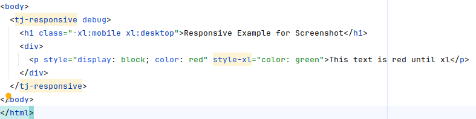

# Responsive Module

The **Responsive Module** provides an easy way to define breakpoints outside of CSS media queries, allowing dynamic DOM updates using JavaScript.

Note: This package is intended to be used via the <tj-responsive> Custom Element. All responsive behavior is active only inside this wrapper.

## Basic Usage



Wrap the area that should react to breakpoints with the Custom Element:

```html
<tj-responsive>
    <div class="-md:d-none md:d-block lg:text-red">
        <\/div>
        <div style="display:none" md-style="display:block;color:red"><\/div> <\/tj-responsive></div>
    </div></tj-responsive
>
```

## Class and Style Syntax

### Class syntax

Attach responsive directives as class tokens:

- -bp:className
    - Applies up to and including breakpoint bp.
- bp:className
    - Applies above breakpoint bp.
- bp1-bp2:className
    - Applies between bp1 and bp2.

Details:

- For -bp:className the class is active for widths ≤ bp.
- For bp:className the class is active for widths > bp.
- For bp1-bp2:className the class is active for widths > bp1 and ≤ bp2.
- Only classes whose conditions match the current width are present on the element; others are not applied.

Example:

```html
<div class="-xl:d-none xl:d-block lg-xxl:text-red"><\/div></div>
```

### Style attribute syntax

Add responsive inline styles via attributes named [breakpoint]-style:

- bp-style="prop:value; prop2:value2"
    - Applies when width ≥ bp.

Multiple responsive style attributes can be placed on the same element. They are evaluated sequentially in the element’s HTML attribute order, and the final inline style is determined by the last attribute that matches the current width.

Important:

- The element’s original style attribute is restored before each responsive attribute is considered, then the matching attribute’s declarations are applied. This means the last matching responsive style attribute wins entirely.
- Put attributes in ascending order to get intuitive overrides (e.g., sm-style, md-style, lg-style, xl-style).

Example:

```html
<div
    style="color:black;border-color:gray"
    sm-style="color:blue"
    md-style="color:green;border-color:green"
    xl-style="color:red"
>
    <\/div>
</div>
```

- <576px → original styles
- ≥576px → blue
- > 768px → green with green border
- ≥1200px → red (last matching attribute wins)

## Breakpoints

Breakpoints are defined in `window.config.breakpoints` and default to Bootstrap's breakpoint system:

- xs: 0px
- sm: 576px
- md: 768px
- lg: 992px
- xl: 1200px
- xxl: 1400px

You can override these values by configuring `window.config.breakpoints`.

## Style-Based Features

You can also define inline styles for different breakpoints using `*-style` attributes.

```html
<div style="display:none" xl-style="display:block;color:red"><\/div></div>
```

Behavior:

- When the viewport width reaches the `xl` breakpoint, `display:block` and `color:red` are applied.
- If you provide multiple responsive style attributes, they are applied one after another in attribute order; the last matching one determines the final inline style.

## Features

- Idempotency: The adjustment process is repeatable, meaning original classes and styles are stored and restored appropriately.
- Mutation Observation: The module dynamically adjusts content when DOM elements are added or modified.
- Debugging: Use <tj-responsive debug> to log changes in the console for troubleshooting.

## Webcomponent Usage

You can easyly use the Responsive Module in a web compent in your lightDom, and in ShadowDom.

### Import and Initialize:

```typescript
import '@trunkjs\/responsive';
```

### Wrap in <tj-responsive> Element:

To enable the responsive features, wrap your content in a `<tj-responsive>` element:

```html
<tj-responsive>
    <div class="-md:d-none md:d-block lg:text-red">Responsive Content<\/div <\/tj-responsive></div></tj-responsive
>
```

## Examples

All examples below assume they are placed inside a <tj-responsive> element.

The following snippets demonstrate typical use-cases for the Responsive Module.

### 1. Show/Hide Elements at Specific Breakpoints

```html
<!-- Hidden on extra-small screens (<576px), visible otherwise -->
<div class="-sm:d-none sm:d-block card">
    <h3>
        Important Notice<\/h3>
        <p>This card is not rendered on very small screens.<\/p> <\/div></p>
    </h3>
</div>
```

### 2. Change Layout Direction

```html
<!-- Flex row that becomes a column on medium screens and below -->
<div class="d-flex md:flex-column">
    
    <div class="content px-4">
        <h1>
            Hello world<\/h1>
            <p>Lorem ipsum dolor sit amet\u2026<\/p> <\/div> <\/div></p>
        </h1>
    </div>
</div>
```

### 3. Inline Style Switching

```html
<!-- Dark theme activates at the lg breakpoint -->
<section lg-style="background:#222;color:#fff" style="background:#fff;color:#000">
    <h2>
        Contrast Section<\/h2>
        <p>The background switches at the lg breakpoint.<\/p> <\/section></p>
    </h2>
</section>
```

### 4. Range-Based Visibility

```html
<!-- Visible only between md (\u2265768px) and xl (<1200px) -->
<nav class="md-xl:d-block -md:d-none xl-:d-none">
    <ul class="nav">
        <li>
            <a href="\/"
                >Home<\/a><\/li>
                <li>
                    <a href="\/docs"
                        >Docs<\/a><\/li>
                        <li><a href="\/contact">Contact<\/a><\/li> <\/ul> <\/nav></a></li></a
                    >
                </li></a
            >
        </li>
    </ul>
</nav>
```

### 5. Combining Classes and Inline Styles

```html
<!-- Card shrinks and gains shadow on small screens -->
<article class="card sm:shadow-lg" -sm-style="max-width:100%;" sm-style="max-width:50%;">
    <h2>
        Adaptive Card<\/h2>
        <p>Resize the window to watch me adapt!<\/p> <\/article></p>
    </h2>
</article>
```

These examples should give you a quick overview on how to leverage the Responsive Module for real-world layouts. Feel free to mix and match class-based and style-based directives to suit your design requirements.
